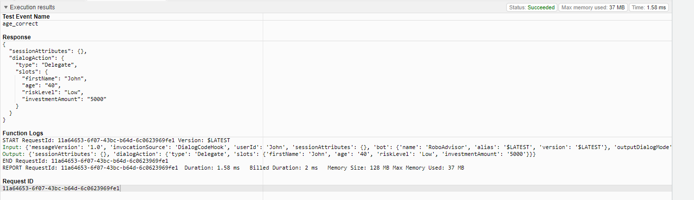
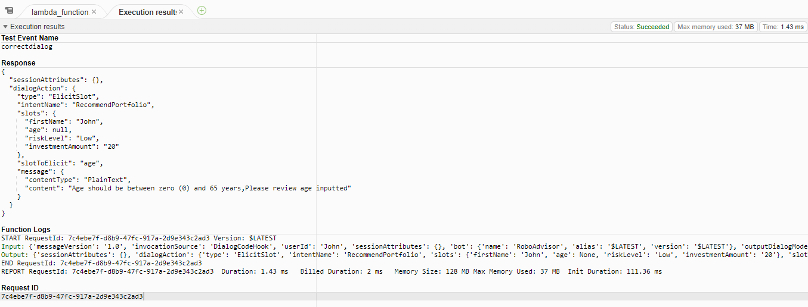

# Fintech-AWS-Lex
## Robo Investment Portfolio Advisor  

### Overview

Created an Amazon Lex robot chat for simple investmest portfolio recommendations.

#### Gif

### Summary

The Robo advisor tested well in the lambda function in regards to the for loop limites on age and investment and but not in the front end interface.

Overall the Robo did what it was programmed to do with regards to the portfolio recommendations.
